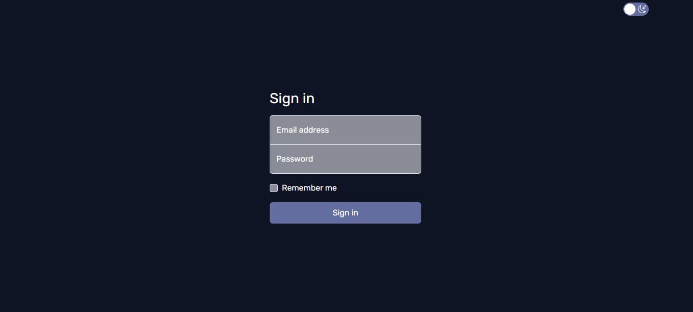

# Frontend Mentor - Time tracking dashboard solution

This is a solution to the [Time tracking dashboard challenge on Frontend Mentor](https://www.frontendmentor.io/challenges/time-tracking-dashboard-UIQ7167Jw). Frontend Mentor challenges help you improve your coding skills by building realistic projects. 

## Table of contents

- [Overview](#overview)
  - [The challenge](#the-challenge)
  - [Screenshot](#screenshot)
  - [Links](#links)
- [My process](#my-process)
  - [Built with](#built-with)
  - [What I learned](#what-i-learned)
  - [Continued development](#continued-development)
  - [Useful resources](#useful-resources)
- [Author](#author)
- [Acknowledgments](#acknowledgments)

## Overview

### The challenge

Users should be able to:

- View the optimal layout for the site depending on their device's screen size
- See hover states for all interactive elements on the page
- Switch between viewing Daily, Weekly, and Monthly stats

Additionaly, there is a sign in page as well as dark/light theme toggle button. You will be able to see more info when you hover over each tile.

### Screenshot




### Links

- Live Site URL: (https://snehaa011.github.io/time-tracking-dashboard/)

## My process

### Built with

- Semantic HTML5 markup
- CSS custom properties
- Flexbox
- CSS Grid
- Bootstrap
- Javascript

### What I learned

I learnt how to use .json file to input data. I learnt how to use Google developer tools to inspect and align the elements well. I was able to reinforce the concepts of flex and grid and got to know where to use which one. I was able to apply Bootstrap components into my page, but most importantly I was able to customise my elements based on Bootstrap documentation.


Tooltips were added to links.
```html
<a href="#" title="Click to see more">
```

Hover effects were interesting and gave me insightful information on transitions and animations.
```css
.hidden{
    opacity:0;
    visibility: hidden;
}
.stat:hover .hidden{
    opacity:1;
    visibility: visible;
    transition: opacity 0.5s ease, visibility 0s;
}
```
I was really proud of learning how to implement .json from stack overflow.
```js
fetch('data.json')
      .then(response => response.json())
        .then(jsonData => {
            const elements = ['work','play','study','exercise','social','self-care'];
            // Iterate over the elements array
            elements.forEach((element,index) => {
                const item = jsonData[index];
                document.querySelector(`.${element} .stat .header .title`).textContent = item.title;
                document.querySelector(`.${element} .stat .current`).textContent = `${item.timeframes.weekly.current}hrs`;
                document.querySelector(`.${element} .stat .previous`).textContent = `Last week- ${item.timeframes.weekly.previous}hrs`;
                });
        })
    .catch(error => console.error('Error fetching data:', error));  
```

### Continued development

I found it challenging to create a hidden div that would be visible when hovered over. Another challenge was creating the dark and light mode toggle button. I tried to implement one from Bootstrap but it was not easy to customize. So after some research, I made my own button. The css part of customizing the button has to be developed upon and needs continued learning.

```css
.profile{
    background-color: #394cb9;
}
body.dark .profile{
    background-color: hsl(235, 46%, 20%) ;
}
```
```js
const checkbox = document.getElementById("checkbox")
    checkbox.addEventListener("change", () => {
    document.body.classList.toggle("dark")
    }) 
```
I am yet to learn how to keep the mode constant throughout all the pages in this website.

### Useful resources

- [Toggle button](https://codepen.io/Umer_Farooq/pen/eYJgKGN) - This helped me to create a customized button for toggle. I was able to apply custom themes for dark and light mode.
- [Hover effect](https://stackoverflow.com/questions/64515232/display-an-image-at-cursor-position-when-hovering-over-a-link) - This is an amazing q+a which helped me understand displaying at cursor point. I'd recommend it to anyone still learning this concept.
- [Toggle a checkbox](https://www.designcise.com/web/tutorial/how-to-toggle-a-checkbox-using-javascript) This article can help you learn the different ways to toggle a checkbox using javascript.

## Author

- Github - [@snehaa011](https://github.com/snehaa011)
- LinkedIn - [Sneha Biju Kurup](https://www.linkedin.com/in/sneha-biju-kurup-994a0b291/)

## Acknowledgments

I would like to thank Angela Yu for making web devolopment interesting and easy to understand. I would like to thank my friends for encouraging and giving constant feedbacks on my project. I express my sincere gratitude to CSEA for giving this opportunity to showcase my skills. I was able to reinforce my learning and definitely, learnt a lot more.

